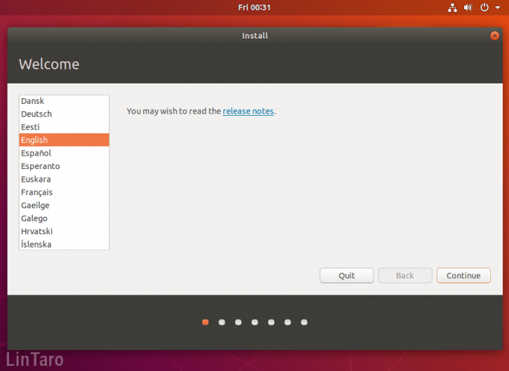

# インターネット工学演習 01
## 導入講義、Linuxのインストールと起動のしくみ


[https://drive.google.com/drive/folders/1qjXjiVEilOj_YUEvXm_Io7T0ggwqVMqa?hl=ja](https://drive.google.com/drive/folders/1qjXjiVEilOj_YUEvXm_Io7T0ggwqVMqa?hl=ja)


## レポートURL


[https://forms.gle/XHuRRGuhvWJRxFcQ7](https://forms.gle/XHuRRGuhvWJRxFcQ7)

## ubuntu18.04 LTS をインストール

* LANケーブルを接続
* USBメモリを接続
* キーボードの bksp キーを連打しながら電源を入れる
* BIOSの設定でシステムをUSB起動にする
* ディスクを初期化する設定でインストール
* user名 kindai
* パスワード：
* 10分くらいでインストール完了

### キーボードの bksp キーを押しながら電源を入れる

タイミングによっては失敗するが、失敗したときは電源の入れ直しをします。

### UEFIの設定


「Install Ubuntu」に移動してからEnterを押す

### Ubuntuの起動後の設定




左側の言語リストをスクロールダウンし、「日本語」をクリック

### キーボードの設定


### インストールタイプ、アップデートのダウンロード、サードパーティソフトウェアのインストール設定


### ストレージ設定


「ディスクを削除してUbuntuをインストール」を選択


### タイムゾーンの設定

「Tokyo（日本標準時）」を設定


### ユーザー情報の設定

名前、コンピューターの名前、ユーザー名、パスワードを入力

* ユーザ名は kindai
* パスワードも指定のものを入れます


### インストールの完了と再起動

USBメモリを抜いて、Enterキーを押してください。


## OSのアップデート

```
sudo apt-get update
sudo apt-get upgrade
```

## アプリのインストール

`
sudo apt-get install ソフト名
`

```
$ sudo apt-get install emacs
```
